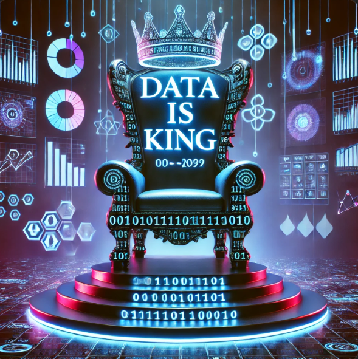
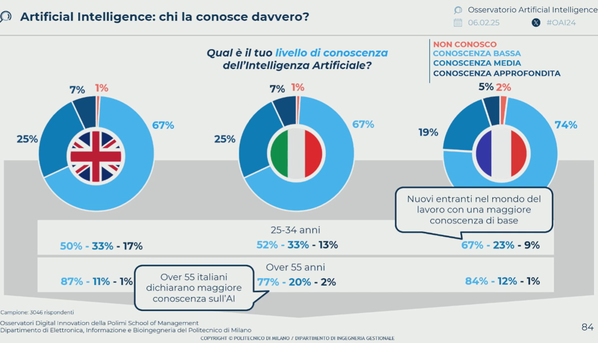

# Data is King

I dati sono estremamente preziosi e fondamentali nel mondo moderno:
1. **Il valore dei dati** → In un'economia sempre più digitale, le decisioni si basano sui dati, non solo sull'intuizione.
2. **Potere competitivo** → Le aziende che sfruttano i dati in modo efficace (analisi, AI, Big Data) hanno un enorme vantaggio.
3. **Personalizzazione e automazione** → I dati permettono di creare esperienze personalizzate per gli utenti, automatizzare processi e migliorare prodotti/servizi.
4. **Influenza nel business e nella politica** → I dati vengono usati per strategie di marketing, previsioni finanziarie e persino per influenzare decisioni politiche.

Chi possiede e sa interpretare i dati **ha il potere** di prendere decisioni migliori e più strategiche.

Nel settore bancario, l'espressione **"Data is King"** significa che i dati sono la risorsa più preziosa per migliorare i servizi finanziari, ridurre i rischi e aumentare la competitività.
### Personalizzazione dei Servizi

Le banche utilizzano i dati per offrire prodotti su misura:

- Analizzano il comportamento finanziario dei clienti per proporre prestiti, mutui o investimenti adatti.
- Creano offerte personalizzate basate sullo storico delle transazioni.

### Valutazione del Rischio e Credit Scoring

I dati sono fondamentali per determinare l’affidabilità creditizia di un cliente:

- Gli algoritmi analizzano reddito, spese e debiti per assegnare un punteggio di credito.
- Le banche usano il **machine learning** per rilevare potenziali insolvenze prima che si verifichino.

### Prevenzione delle Frodi e Sicurezza

L’analisi dei dati permette di individuare transazioni sospette in tempo reale:

- Le banche monitorano pattern di spesa anomali per prevenire frodi.
- La biometria (impronte digitali, riconoscimento facciale) migliora la sicurezza basandosi su dati unici dei clienti.

### Ottimizzazione della Customer Experience

I dati aiutano le banche a migliorare l'interazione con i clienti:

- Chatbot e assistenti virtuali personalizzano il supporto.
- Le app bancarie suggeriscono modi per risparmiare e investire in base allo storico del cliente.

### Compliance e Regolamentazione

Nel settore bancario, la gestione dei dati è cruciale per rispettare normative come:

- **GDPR** (protezione dati personali)
- **Basilea III** (rischio di credito e capitale)
- **AML (Anti-Money Laundering)** per prevenire il riciclaggio di denaro.

Le banche che sfruttano al meglio i dati migliorano la sicurezza, la customer experience e la redditività. Chi padroneggia i dati, ha il vero potere nel settore finanziario.

## Uso dell'Intelligenza artificiale in banca

L'**Intelligenza Artificiale (AI) nei dati bancari** sta trasformando il settore finanziario, rendendo i servizi più efficienti, sicuri e personalizzati. Ecco come viene applicata l’AI nei dati bancari:

### Analisi Predittiva per il Credit Scoring

L'AI analizza enormi quantità di dati per prevedere il comportamento finanziario di un cliente e migliorare il **credit scoring**: 
- Analizza transazioni, reddito e spese
- Valuta la probabilità di insolvenza con algoritmi di **machine learning**
- Consente di approvare o rifiutare prestiti in tempo reale con meno rischi.

**Esempio:** Modelli AI alternativi aiutano chi non ha uno storico creditizio a ottenere finanziamenti, analizzando dati come pagamenti di utenze o comportamento online.

### Rilevazione Frodi e Sicurezza

Le banche utilizzano l'AI per individuare **transazioni sospette in tempo reale**: - Gli algoritmi analizzano pattern di spesa e segnalano anomalie.  
- L’AI blocca operazioni fraudolente e avvisa il cliente.  
- Biometria e **deep learning** migliorano la sicurezza nelle autenticazioni (riconoscimento facciale, impronte digitali).

**Esempio:** Se una carta viene usata in un paese straniero mentre il cliente è altrove, l’AI può bloccare il pagamento e richiedere una verifica.

### Chatbot e Assistenza Virtuale

L'AI migliora il **customer service** attraverso chatbot avanzati e assistenti virtuali:  
- Rispondono 24/7 a domande su saldo, bonifici, pagamenti.  
- Offrono consigli finanziari basati sullo storico del cliente.  
- Possono gestire operazioni complesse, riducendo i tempi di attesa nei call center.

**Esempio:** Chatbot come **Erica di Bank of America** o **Eva di HDFC Bank** aiutano i clienti a controllare il saldo, pianificare risparmi e segnalare problemi.

### Gestione degli Investimenti e Fintech AI

Le **robo-advisor** utilizzano l'AI per creare strategie di investimento personalizzate:  
- Analizzano dati di mercato in tempo reale.  
- Suggeriscono asset in base al profilo di rischio del cliente.  
- Automatizzano il trading sfruttando opportunità di mercato.

**Esempio:** Piattaforme come **Betterment** e **Wealthfront** usano l'AI per creare portafogli su misura.

### Prevenzione del Riciclaggio di Denaro (AML)

Le banche devono rispettare regolamenti antiriciclaggio (**AML**). L’AI aiuta a:  
- Rilevare operazioni sospette tra milioni di transazioni.  
- Generare alert su comportamenti anomali.  
- Automatizzare i controlli di conformità, riducendo i falsi positivi.

**Esempio:** L’AI può scoprire schemi di riciclaggio analizzando trasferimenti fra conti, anche se avvengono con piccole somme per evitare controlli manuali.

### Ottimizzazione della Customer Experience

- **Analisi comportamentale**: l’AI prevede i bisogni del cliente prima che li esprima.  
- **Raccomandazioni personalizzate**: l’AI suggerisce prodotti finanziari basati sulle abitudini del cliente.  
- **Gestione delle spese**: alcune app bancarie usano l’AI per suggerire modi per risparmiare.

**Esempio:** **Revolut** e **N26** usano l’AI per fornire previsioni di spesa e suggerimenti finanziari personalizzati.

### Strumenti e Tecnologie Usate nelle Banche

- **Machine Learning (ML)**: per analisi predittive e rilevamento frodi.
- **Natural Language Processing (NLP)**: per chatbot e comprensione delle richieste clienti.
- **Deep Learning**: per analisi avanzate di frodi e modelli di rischio.
- **Blockchain & AI**: per aumentare la sicurezza nelle transazioni.

L'Intelligenza Artificiale sta trasformando il settore bancario **rendendo i servizi più sicuri, veloci e personalizzati**. Le banche che sfruttano meglio l'AI hanno un **vantaggio competitivo** enorme, soprattutto nel miglioramento della sicurezza e dell'esperienza cliente.

# Il tech in banca

Un [report](https://www.bloomberg.com/news/articles/2025-01-09/wall-street-expected-to-shed-200-000-jobs-as-ai-erodes-roles?srnd=technology-ai) di Bloomberg Intelligence prevede che l’intelligenza artificiale causerà la riduzione di circa 200.000 posti di lavoro nel settore bancario globale nei prossimi 3-5 anni ([Bloomberg News, 2025](https://paolovolterra.github.io/posts/2506_IAInBanca/IaBanca.html#ref-wall_street_job_losses_ai)).

Nel marzo del 2023, Goldman Sachs aveva pubblicato una ricerca secondo la quale nei successivi 10 anni si sarebbero persi 300 milioni di posti di lavoro.

Secondo [BCG](https://www.bcg.com/press/6september2023-lutilizzo-di-strumenti-di-genai-riduce-i-tempi-di-lavoro-del-50-per-singola-attivita) l’utilizzo di strumenti di GenAI ridurrà i tempi di lavoro del 50% per singola attività.

Questo cambiamento riguarderà soprattutto mansioni ripetitive del back office e di assistenza clienti, ma porterà anche a un aumento della produttività e dei profitti per le banche, stimato tra il 12% e il 17%.

Sebbene molti posti di lavoro siano a rischio di automazione, si assisterà più a una trasformazione dei ruoli che a una sostituzione totale, con la creazione di nuove posizioni legate allo sviluppo e alla gestione dell’AI.

In un precedente articolo (Il Sole 24 Ore Mercoledì 4 Dicembre 2024) si discuteva dell’impatto della #GenAI evidenziando una mancanza di preparazione significativa da parte delle istituzioni.

Mentre molte banche si concentrano sul taglio dei costi tramite la GenAI (63% degli istituti secondo BCG), il successo delle strategie dipende soprattutto dal fattore umano (70%), attraverso la riqualificazione del personale e la trasformazione organizzativa.

Studi di Banca d’Italia confermano l’alta esposizione del settore finanziario alla sostituzione automatizzata di posti di lavoro, sottolineando la necessità di investimenti significativi in formazione e upskilling per evitare conseguenze negative.

Secondo il report #Bankit [An assessment of occupational exposure to artificial intelligence in Italy](https://www.bancaditalia.it/pubblicazioni/qef/2024-0878/index.html), l’#IA è già presente e il suo impatto crescerà esponenzialmente.

C’è però scarsezza di piani specifici per lo sviluppo delle competenze in GenAI nel settore bancario a livello globale (solo il 5% delle banche ne ha uno).

## Le “Tech”

Molte delle ultime tecnologie utilizzano l’**intelligenza artificiale #IA** e, in alcuni casi, **robot** (sia fisici che software) per migliorare i servizi bancari e finanziari:

L’**Intelligenza Artificiale (IA)** è ampiamente utilizzata in quasi tutte le tecnologie per migliorare l’efficienza, personalizzare i servizi, analizzare grandi quantità di dati e rafforzare la sicurezza. I **Robot Software**, come i chatbot e i processi automatizzati (RPA), sono comuni in **AI/ML in Banking**, **RegTech**, **WealthTech** e altre aree per automatizzare le interazioni con i clienti e i processi interni. I **Robot Fisici**, meno comuni nel settore bancario, possono essere utilizzati in **filiali sperimentali** per migliorare l’esperienza del cliente o in ambito **IoT**, come ATM intelligenti.

## Tabella delle Tech

| **Tecnologia** | **Descrizione** | **Esempi** | **Lavori Ripetitivi Sostituibili** |
| --- | --- | --- | --- |
| **AI/ML in Banking** | Intelligenza artificiale per automazione, prevenzione frodi e analisi. | Chatbot bancari, rilevamento frodi con AI. | Gestione delle richieste di base dei clienti, monitoraggio delle transazioni, analisi dei dati. |
| **Biometric Banking** | Tecnologie biometriche per autenticazione sicura. | Riconoscimento facciale, impronte digitali, scansione dell’iride. | Verifica dell’identità manuale, controllo accessi fisici. |
| **Cloud Banking Technology** | Infrastrutture cloud per maggiore agilità, scalabilità e riduzione dei costi. | AWS, Microsoft Azure per servizi bancari. | Gestione manuale di infrastrutture IT e backup. |
| **CryptoTech** | Tecnologie basate su blockchain e criptovalute. | Binance, Coinbase, wallet digitali. | Esecuzione manuale di transazioni ripetitive. |
| **CyberTech** | Soluzioni di cybersecurity per proteggere da attacchi e violazioni. | Autenticazione biometrica, crittografia avanzata. | Monitoraggio manuale della sicurezza, risposta a minacce. |
| **DataTech** | Analisi dei Big Data per decisioni strategiche e personalizzazione. | CRM avanzati, strumenti di data visualization. | Elaborazione manuale di report e analisi dati. |
| **FinTech** | Innovazioni nei servizi finanziari tradizionali. | PayPal, Stripe, Revolut, N26. | Elaborazione di pagamenti, apertura conti, riconciliazioni manuali. |
| **Green Finance Technology** | Soluzioni per gestire finanziamenti sostenibili e monitorare l’impatto ambientale. | Piattaforme ESG per il monitoraggio ambientale. | Raccolta manuale di dati ESG, preparazione di report ambientali. |
| **InsurTech** | Tecnologie per migliorare i processi assicurativi. | Lemonade, Trov. | Elaborazione manuale di richieste di sinistri, valutazione rischi di base. |
| **IoT in Banking** | Dispositivi connessi per migliorare l’esperienza bancaria. | Wearable per pagamenti contactless, ATM intelligenti. | Operazioni di cassa fisica, interazioni di base con i clienti. |
| **LendTech** | Tecnologie per il prestito e valutazioni del credito. | LendingClub, Funding Circle. | Valutazioni manuali del credito, gestione delle pratiche di prestito. |
| **Open Banking Technology** | API per condividere dati finanziari con terze parti in modo sicuro. | Soluzioni basate su PSD2 in Europa. | Raccolta e condivisione manuale di dati con terze parti. |
| **PayTech** | Tecnologie per pagamenti digitali. | Google Pay, Apple Pay, SumUp. | Elaborazione manuale dei pagamenti, riconciliazione transazioni. |
| **PropTech** | Tecnologie per il settore immobiliare. | Zillow, Casavo, piattaforme per la valutazione immobiliare. | Valutazioni immobiliari manuali, raccolta dati di mercato. |
| **RegTech** | Tecnologie per la conformità normativa. | Piattaforme di compliance automatizzata, analisi normativa con AI. | Controllo manuale della conformità normativa, generazione report di audit. |
| **WealthTech** | Soluzioni per la gestione del patrimonio e investimenti. | Betterment, eToro, Moneyfarm. | Analisi patrimoniale di base, consulenza finanziaria ripetitiva. |

## Riferimenti Bibliografici

1. Wall Street potrebbe perdere oltre 200.000 posti di lavoro a causa dell’IA ([Bloomberg News, 2025](https://paolovolterra.github.io/posts/2506_IAInBanca/IaBanca.html#ref-wall_street_job_losses_ai)).
2. L’IA sostituirà 200.000 dipendenti nel settore bancario ([Il Sole 24 Ore, 2025](https://paolovolterra.github.io/posts/2506_IAInBanca/IaBanca.html#ref-banche_ai_200k_dipendenti_ilsole24ore)).
3. L’IA manderà in ‘pensione’ molti lavoratori bancari ([Italia Oggi, 2025](https://paolovolterra.github.io/posts/2506_IAInBanca/IaBanca.html#ref-banche_ai_200k_dipendenti_italiaoggi)).
4. JPMorgan utilizza l’IA per aumentare i posti di lavoro anziché sostituirli ([Bloomberg News, 2024b](https://paolovolterra.github.io/posts/2506_IAInBanca/IaBanca.html#ref-jpmorgan_ai_rollout_jobs)).
5. Citi ritiene che l’IA sostituirà più lavori nel settore bancario rispetto ad altri settori ([Bloomberg News, 2024a](https://paolovolterra.github.io/posts/2506_IAInBanca/IaBanca.html#ref-citi_ai_displacing_jobs)).
6. Dimon vede l’IA offrire una settimana lavorativa di 3 giorni e mezzo per le generazioni future ([Bloomberg News, 2023](https://paolovolterra.github.io/posts/2506_IAInBanca/IaBanca.html#ref-dimon_ai_shorter_workweek)).

# Gli Investimenti Bancari in AI
Tendenze, Strategie e Impatti

Le banche stanno investendo **miliardi di dollari** nell’**Intelligenza Artificiale (AI)** per migliorare sicurezza, efficienza operativa e customer experience. 
L’AI non è più solo un’innovazione sperimentale, ma un elemento chiave per la competitività nel settore finanziario.
Le banche stanno **scommettendo fortemente sull’AI**, perché porta vantaggi in termini di sicurezza, efficienza e soddisfazione del cliente. 
La sfida è **bilanciare innovazione e compliance**, evitando rischi etici e di cybersecurity.

## Quanto investono le banche in AI

Secondo le ultime analisi:  
- **Nel 2023**, le banche hanno investito oltre **77 miliardi di dollari** in AI e automazione.  
- Si prevede che il valore degli investimenti in AI nel settore finanziario supererà **150 miliardi di dollari entro il 2027**.  
- Le principali aree di investimento riguardano **Machine Learning, Generative AI, RPA e sicurezza anti-frode**.

🔹 **Banche leader nell’AI**: JPMorgan Chase, Goldman Sachs, Bank of America, HSBC e Deutsche Bank sono tra le più attive negli investimenti AI.

## Perché le banche investono in AI

L'adozione dell’AI è motivata da diversi fattori:  
- **Riduzione dei costi operativi** – Automazione e ottimizzazione dei processi riducono il personale necessario per attività ripetitive.  
- **Migliore gestione dei rischi** – Algoritmi AI prevedono insolvenze e individuano frodi con maggiore precisione.  
- **Customer Experience migliorata** – Chatbot intelligenti, consulenza personalizzata e servizi finanziari basati su AI.  
- **Trading algoritmico avanzato** – L'AI permette operazioni più rapide e accurate nel mercato finanziario.

## Principali Aree di Investimento in AI nel Settore Bancario

### Rilevazione Frodi & Sicurezza

Le banche investono in AI per **rilevare transazioni sospette e prevenire cyber-attacchi**.  
- **Analisi in tempo reale** – AI monitora le transazioni e blocca operazioni anomale.  
- **Rilevamento di deepfake e identità false** – Verifica biometrica e controllo avanzato dell’identità.  
- **Protezione da attacchi informatici** – AI potenzia la cybersecurity con sistemi di auto-apprendimento.

**Esempio:** HSBC ha investito in AI per ridurre del **70%** le frodi nelle transazioni internazionali.

### Automazione con RPA & AI

Molte banche utilizzano **Robotic Process Automation (RPA)** e AI per **automatizzare processi ripetitivi**, come:  
- Elaborazione dei pagamenti e bonifici.  
- Validazione di documenti e verifica KYC (_Know Your Customer_).  
- Compliance con normative bancarie ed AML (_Anti-Money Laundering_).

**Esempio:** JPMorgan utilizza un sistema AI chiamato **COIN** che analizza **contratti bancari** in pochi secondi, risparmiando oltre **360.000 ore di lavoro umano** all'anno.

### AI per il Credit Scoring & Risk Management

Le banche stanno rivoluzionando la concessione di prestiti grazie all’AI:  
- Modelli di **Machine Learning** per valutare il rischio di credito basandosi su dati non tradizionali (es. abitudini di spesa).  
- AI per **prevedere insolvenze** e migliorare la gestione dei rischi finanziari.  
- Valutazione più accurata per i clienti **senza storico creditizio** (utilizzando dati alternativi come bollette, affitti, ecc.).

**Esempio:** Goldman Sachs utilizza AI per analizzare dati non convenzionali nei prestiti a piccole imprese.

### Chatbot AI & Assistenza Clienti

Le banche investono in **AI conversazionale** per migliorare il customer service:  
- **Chatbot bancari avanzati** – Assistenza clienti 24/7 con AI generativa.  
- **AI per consulenza finanziaria personalizzata** – Analizza le spese e suggerisce strategie di risparmio.  
- **Riconoscimento del linguaggio naturale (NLP)** per un’interazione più fluida.

**Esempio:** **Bank of America** ha lanciato "Erica", un assistente AI che ha gestito oltre **1 miliardo di interazioni** con clienti in pochi anni.

### AI nel Trading & Fintech

L’AI è essenziale per **il trading algoritmico** e la gestione degli investimenti:  
- **Trading ad alta frequenza (HFT)** – L’AI prende decisioni in millisecondi.  
- **Analisi predittiva** – L’AI analizza dati di mercato per prevedere tendenze e strategie.  
- **Wealth Management AI** – Robo-advisor che creano strategie di investimento personalizzate.

**Esempio:** BlackRock utilizza **Aladdin AI**, una piattaforma che gestisce **miliardi di dollari** di investimenti con algoritmi avanzati.

## Benefici degli Investimenti in AI per le Banche

- **+60% di efficienza operativa** grazie all’automazione.  
- **Riduzione delle frodi fino all’80%** con AI per il rilevamento delle transazioni sospette.  
- **Aumento del 30-40% nella soddisfazione dei clienti** grazie a chatbot e consulenza personalizzata.  
- **Miglioramento della compliance e riduzione delle sanzioni** grazie ad AI per il monitoraggio regolamentare.

## Sfide & Rischi dell’AI nel Settore Bancario

Nonostante i vantaggi, ci sono ancora alcune sfide da affrontare:  
- **Rischio di bias negli algoritmi** – Decisioni errate se i dati di training non sono bilanciati.  
- **Regolamentazione & compliance** – Le banche devono garantire che l’uso dell’AI rispetti le normative.  
- **Cybersecurity & Deepfake** – L’AI può essere usata anche dai criminali per creare frodi più sofisticate.  
- **Resistenza al cambiamento** – Molti dipendenti e clienti sono scettici sull’AI.

**Soluzioni:** Investire in **modelli più trasparenti**, implementare **AI explainability** (AI interpretabile) e rafforzare la **cybersecurity**.

## Il Futuro dell’AI nelle Banche: Tendenze 2025-2030

🔹 **AI Generativa per la creazione automatizzata di report finanziari** 📑  
🔹 **Blockchain + AI per maggiore sicurezza nelle transazioni** 🔗  
🔹 **Banking-as-a-Service (BaaS) potenziato dall’AI** 🏦  
🔹 **Riconoscimento facciale + AI per autenticazione senza password** 🛡

**Previsione:** Entro il 2030, l’AI sarà la tecnologia dominante nel settore bancario, rendendo i servizi più **efficienti, sicuri e personalizzati**.

# I nuovi paradigmi normativi

**AI Act, FIDA, DORA e NIS2**, stanno ridefinendo il rapporto tra **banche, tecnologia e gestione del rischio**. 
Le istituzioni finanziarie, già altamente regolamentate, devono ora adattarsi a normative che mirano a garantire **sicurezza, trasparenza e affidabilità** nell’uso dell’Intelligenza Artificiale e delle infrastrutture digitali.

L’**AI Act** impone regole rigorose sull’uso di modelli AI nelle decisioni finanziarie, limitando il rischio di **bias nei credit scoring** o di frodi legate a sistemi automatizzati. 
Le banche devono implementare **AI spiegabile e auditabile**, riducendo il rischio di sanzioni per discriminazione algoritmica. 
Parallelamente, il **FIDA** spinge per una gestione responsabile dei dati finanziari, imponendo maggiore trasparenza sulle tecnologie impiegate.

Dal lato della sicurezza operativa, il **DORA** introduce requisiti più stringenti per la **resilienza digitale**, obbligando le banche a garantire la continuità dei servizi anche in caso di attacchi informatici. 
La **NIS2**, invece, amplia gli obblighi di cybersecurity, imponendo una gestione proattiva delle minacce su infrastrutture critiche.

In sintesi, questi regolamenti trasformano le banche in **hub tecnologici più sicuri, trasparenti e resilienti**, costringendole a un’evoluzione strategica che combina innovazione AI con rigide misure di compliance e cybersecurity.

## Gli Organi di Vigilanza e il Controllo del Settore Bancario

Le banche operano in un contesto altamente regolamentato, soggetto alla supervisione di diversi **organi di vigilanza**, che ne garantiscono **stabilità, sicurezza e conformità normativa**. Con l'introduzione di regolamenti come **AI Act, FIDA, DORA e NIS2**, il ruolo di queste autorità si è rafforzato, soprattutto nell’ambito della digitalizzazione e della gestione dei rischi tecnologici.

Con la crescente digitalizzazione bancaria, le autorità di vigilanza hanno ampliato il loro ruolo per affrontare **nuove sfide tecnologiche e di sicurezza**:

🔹 **AI Act & BCE/EBA** → Impone alle banche requisiti di **trasparenza sugli algoritmi AI**, riducendo rischi di discriminazione o decisioni opache sui crediti.  
🔹 **FIDA & GDPR** → Maggiore protezione dei **dati finanziari**, con vigilanza rafforzata sulla gestione e condivisione delle informazioni.  
🔹 **DORA & BCE/NIS2** → Impone test di **resilienza operativa** e obbliga le banche a **piani di emergenza IT** per affrontare cyberattacchi.  
🔹 **AML & FATF/Banca d’Italia** → Rafforza il monitoraggio sulle operazioni sospette grazie all’**uso di AI per l’antiriciclaggio**.

## **Impatti per le Banche**

Gli organi di vigilanza non si limitano più alla stabilità finanziaria, ma giocano un ruolo centrale nel **governare l’innovazione digitale**, garantendo che l’uso di AI e tecnologie avanzate nelle banche sia **sicuro, trasparente e resiliente**.

✅ **Maggiore trasparenza** → Obbligo di spiegare le decisioni AI nei prestiti e negli investimenti.  
✅ **Cybersecurity rafforzata** → Sistemi di difesa più robusti e gestione del rischio IT obbligatoria.  
✅ **Compliance più rigorosa** → Obbligo di conformarsi a regole più stringenti sui dati e sulle infrastrutture digitali.

# La confusione fra AI, GenAI e RPA

**AI (Intelligenza Artificiale), GenAI (Intelligenza Artificiale Generativa) e RPA (Robotic Process Automation)** vengono spesso confusi, non solo dal cliente, ma anche dall'addetto: tutte e tre le tecnologie riguardano l’automazione e il miglioramento dei processi.
Tuttavia, hanno differenze fondamentali

## Tabella di confronto AI vs. GenAI vs. RPA

| Tecnologia | Funzione principale              | Esempi bancari                      | Capacità di apprendimento? |
| - | -- | -- | -- |
| **AI**     | Analizza dati e prende decisioni | Credit Scoring, Rilevamento Frodi   | - Sì                       |
| **GenAI**  | Crea testo, immagini, codice     | Report finanziari, Chatbot avanzati | - Sì (ma creativa)         |
| **RPA**    | Automatizza compiti ripetitivi   | Pagamenti automatici, Data Entry    | ❌ No                       |

## Quando è usata AI, GenAI o RPA in banca

- **Se serve automazione semplice** → RPA (ad es. processare transazioni, verificare documenti).  
- **Se servono decisioni basate sui dati** → AI (ad es. rilevare frodi, assegnare punteggi di credito).  
- **Se serve generare contenuti o conversazioni avanzate** → GenAI (ad es. chatbot avanzati, reportistica automatica).

## AI – Intelligenza Artificiale

L'**AI (Artificial Intelligence)** è un insieme di tecnologie che simulano l’intelligenza umana per prendere decisioni, riconoscere schemi e migliorare con l’esperienza.

###  Caratteristiche principali

- Analizza dati e apprende (Machine Learning).  
- Prende decisioni basate su modelli predittivi.  
- Può lavorare su dati strutturati e non strutturati.

###  Esempi di AI in banca

📊 **Credit Scoring** – Valuta il rischio di insolvenza basandosi su dati finanziari.  
🔍 **Frode bancaria** – Rileva operazioni sospette monitorando transazioni in tempo reale.  
🤖 **Chatbot AI (NLP)** – Comprende il linguaggio naturale per rispondere ai clienti.

## GenAI – Intelligenza Artificiale Generativa

La **Generative AI** è una sottocategoria dell’AI che si concentra sulla **creazione di nuovi contenuti** (testo, immagini, codice, musica, ecc.).

### Caratteristiche principali

- Crea testo, immagini, video o codice in base ai dati forniti.  
- Modelli come GPT (per testo), DALL·E (per immagini) e Codex (per codice).  
- Può generare risposte, traduzioni, riassunti e simulare conversazioni avanzate.

### Esempi di GenAI in banca

 **Analisi automatica di documenti** – Estrarre informazioni da contratti, bilanci e report.  
**Chatbot avanzati** – Chatbot che rispondono in modo più naturale e contestuale.  
**Generazione di report finanziari** – Creazione automatica di analisi e previsioni economiche.

**Differenza tra AI e GenAI:**  
L'AI è più **analitica e decisionale**, mentre la GenAI è **creativa** e può generare contenuti autonomamente.

## RPA – Robotic Process Automation

L’**RPA (Robotic Process Automation)** è una tecnologia che utilizza **bot software** per automatizzare attività ripetitive basate su regole **senza intelligenza vera**.

### Caratteristiche principali

- Automatizza compiti ripetitivi e basati su regole.  
- Non ha capacità di apprendimento come l’AI (esegue esattamente ciò che è programmato).  
- Interagisce con software e sistemi esistenti imitando le azioni umane.

### Esempi di RPA in banca

**Automazione dei pagamenti** – I bot RPA elaborano bonifici e fatture senza errori.  
 **Verifica documenti** – Estraggono e inseriscono dati nei sistemi bancari.  
**Reportistica automatizzata** – Generano report periodici senza intervento umano.

🔹 **Differenza tra AI e RPA:**

- **AI** apprende ed evolve, mentre **RPA** esegue solo azioni predefinite.
- **AI** è utile in scenari complessi (analisi dati, riconoscimento immagini), mentre **RPA** è perfetto per compiti ripetitivi (trasferimento dati tra software).

# Fintech, AI e Comportamento della Clientela
Nuove Frontiere per Banche, Intermediari Finanziari e Finanza d’Impresa

L’innovazione tecnologica sta ridefinendo il settore finanziario, con **Fintech e Intelligenza Artificiale (AI)** che stanno trasformando l’interazione tra **banche, intermediari finanziari e imprese**. Queste nuove tecnologie **automatizzano processi, migliorano l’efficienza e personalizzano i servizi**, ridefinendo il comportamento della clientela e le strategie delle istituzioni finanziarie.

Fintech e AI stanno ridisegnando il settore bancario, imponendo un **cambiamento nelle strategie delle banche, degli intermediari finanziari e delle imprese**. L’**automazione e la personalizzazione** sono le chiavi per attrarre e fidelizzare una clientela sempre più digitale. Per restare competitivi, gli operatori finanziari devono **abbracciare queste nuove tecnologie** e adattarsi rapidamente alle **nuove esigenze di mercato**.

## L’impatto del Fintech sulle Banche Tradizionali

Le **Fintech**, grazie a tecnologie come **blockchain, AI e open banking**, stanno cambiando il modo in cui i clienti accedono ai servizi finanziari. Le banche tradizionali devono rispondere con:

✅ **Digitalizzazione dei servizi** – Home banking avanzato e interfacce utente intuitive.  
✅ **Pagamenti istantanei & Open Banking** – API che integrano conti bancari con servizi di terze parti.  
✅ **Prestiti e mutui digitalizzati** – Processi di concessione automatizzati basati su AI.  
✅ **Tokenizzazione degli asset** – Nuovi strumenti di investimento tramite blockchain.

📌 **Esempio:** Revolut e N26 offrono **esperienze bancarie completamente digitali**, sfidando il modello tradizionale.

## AI e Personalizzazione nei Servizi Finanziari

L’**Intelligenza Artificiale** consente di analizzare enormi quantità di dati per offrire servizi su misura:

✅ **Analisi predittiva** – Prevede le esigenze finanziarie del cliente (es. risparmi, investimenti).  
✅ **Chatbot intelligenti** – Assistenti virtuali risolvono problemi in tempo reale.  
✅ **AI per la gestione patrimoniale** – Robo-advisor personalizzano strategie di investimento.  
✅ **Prevenzione delle frodi** – Algoritmi di machine learning rilevano transazioni sospette.

📌 **Esempio:** **JP Morgan** utilizza AI per il trading e per analizzare documenti contrattuali in pochi secondi.

## Evoluzione del Comportamento della Clientela

La clientela sta cambiando il proprio approccio ai servizi finanziari, preferendo **esperienze digitali e personalizzate**:

🔹 **Maggiore fiducia nei servizi Fintech** – Più utenti scelgono neobank e piattaforme alternative.  
🔹 **Domanda di servizi più veloci e intuitivi** – Si riduce la pazienza per burocrazia e processi lenti.  
🔹 **Crescente attenzione alla sicurezza e alla privacy** – GDPR e AI explainability diventano centrali.  
🔹 **Nuove abitudini di investimento** – Interesse per asset digitali, criptovalute e prodotti ESG.

📌 **Dati:** Il 74% dei Millennials preferisce gestire le proprie finanze tramite app mobile piuttosto che in filiale.

## Finanza d’Impresa e AI: Nuove Opportunità per le Aziende

L’AI e il Fintech stanno ridefinendo anche la **finanza aziendale**:

✅ **Automazione della contabilità** – AI per la gestione di cash flow e report finanziari.  
✅ **Accesso ai finanziamenti alternativo** – Crowdfunding, peer-to-peer lending e fintech lending.  
✅ **Risk management avanzato** – AI per valutare rischi finanziari e creditizi in tempo reale.  
✅ **Supply Chain Finance** – Blockchain per la trasparenza nelle transazioni aziendali.

📌 **Esempio:** **Stripe e Klarna** offrono soluzioni di pagamento integrate per le imprese, migliorando il cash flow.

# La Doppia (Tripla) Transizione: Digitale, Green e Generazionale

Il settore bancario si trova al centro di una **doppia, se non tripla, transizione** che coinvolge la **digitalizzazione, la sostenibilità e il cambiamento generazionale**. Tuttavia, fattori come l'**analfabetismo informatico**, l'**età media elevata dei bancari** e il **digital divide** rendono questa trasformazione complessa e ricca di sfide.

- **Transizione Digitale** → Automazione, AI, blockchain, neobank.  
- **Transizione Green** → Investimenti ESG, finanza sostenibile.  
- **Transizione Generazionale** → Cambio tra vecchia e nuova classe di bancari.

**Sfida principale**: bilanciare innovazione e sostenibilità, senza perdere il contatto con una clientela diversificata.

La digitalizzazione è inevitabile, ma il settore bancario deve affrontare **sfide culturali e formative**. Le istituzioni devono investire in **formazione, mentorship e strategie inclusive** per assicurare che l’innovazione non lasci indietro nessuno, favorendo una **transizione armonica** tra generazioni e modelli operativi.

## Analfabetismo Informatico & Digital Divide

🔹 Molti dipendenti bancari **non hanno competenze digitali avanzate**, rendendo complessa l’adozione di nuove tecnologie.  
🔹 Il **digital divide** crea disparità tra clienti giovani (nativi digitali) e quelli più anziani, meno avvezzi ai servizi online.  
🔹 L’uso dell’AI nei servizi finanziari richiede personale formato per evitare errori nell’automazione e nei processi decisionali.

**Soluzione**: Investire in **formazione digitale** per dipendenti e clienti, con il supporto di enti come **Fabi, AIPB e Feduf**.

## L’Età Media del Bancario e il Passaggio Generazionale

🔹 L’**età media del bancario** è attorno ai 50 anni, e molti faticano ad adattarsi alle nuove tecnologie.  
🔹 Il **passaggio generazionale** è complesso: i giovani hanno competenze digitali, ma meno esperienza finanziaria e gestionale.  
🔹 Le banche devono **riformare i modelli organizzativi**, valorizzando l’esperienza dei senior e la flessibilità dei giovani.

**Soluzione**: Creazione di **mentorship** tra bancari senior e junior per una **transizione più fluida**.

---

## Il Ruolo della Formazione (FOT, Feduf, Fabi, AIPB)

🔹 **FOT (Fondo per l’Occupazione del Credito)** → Supporta piani di aggiornamento professionale per bancari.  
🔹 **Feduf (Educazione Finanziaria e Digitale)** → Promuove l’alfabetizzazione finanziaria nelle scuole e tra i cittadini.  
🔹 **Fabi (Sindacato Bancari)** → Difende i diritti dei lavoratori nel contesto della digitalizzazione.  
🔹 **AIPB (Private Banking)** → Supporta la formazione per i professionisti del wealth management.

 **Obiettivo**: Un piano strategico per **formare bancari e clienti**, riducendo il digital divide e facilitando la transizione tecnologica.

# La GenAI in banca

| **Tema**                    | **Dati principali**                                                                               |
| --------------------------- | ------------------------------------------------------------------------------------------------- |
| **Adozione GenAI**          | 88% delle banche con strategia entro il 2025 (38% già operativa).                                 |
| **Sperimentazione**         | 69% in fase di test, 60% con progetti AI in produzione.                                           |
| **Investimenti**            | 82% aumenterà il budget AI, 88% incrementerà gli investimenti in GenAI.                           |
| **Fattori di investimento** | 80% valuta benefici attesi, 67% considera costi e compliance.                                     |
| **ROI atteso**              | 75% senza tempistiche precise, 13% prevede ROI entro 1 anno.                                      |
| **Strategia "Make or Buy"** | "Make" per studio e gestione rischi (40%), "Buy" per formazione e sviluppo.                       |
| **Partnership**             | 54% collabora con BigTech/ICT, future sinergie con Software Vendor (55%) e startup fintech (45%). |
| **Governance AI**           | 81% monitora AI, 77% integra GenAI nei team AI/Innovazione, 23% ha un team dedicato.              |
| **Skill gap & Formazione**  | 57% ha gap in Ethics, Data Science, Testing; 75% investe in change management.                    |
| **Conformità AI Act**       | 70% in fase di adeguamento, 50% ha già un framework di governance.                                |
Fonte: **Deloitte** nell’ambito dell’**Osservatorio Fintech Innovation

| **Tema**                                        | **Dati e Informazioni**                                                                                                                                                                                                                                                                                                                                                                                                                                                                         |
| ----------------------------------------------- | ----------------------------------------------------------------------------------------------------------------------------------------------------------------------------------------------------------------------------------------------------------------------------------------------------------------------------------------------------------------------------------------------------------------------------------------------------------------------------------------------- |
| **Adozione della GenAI**                        | - **88%** delle banche italiane avrà una strategia GenAI entro il **2025** (già operativa nel **38%** dei casi).- **80%** delle banche integra la GenAI nella strategia AI complessiva.                                                                                                                                                                                                                                                                                                         |
| **Sperimentazione e Produzione**                | - **69%** delle banche è in fase di sperimentazione per la GenAI.- **60%** ha già progetti AI in produzione.                                                                                                                                                                                                                                                                                                                                                                                    |
| **Investimenti e Budget**                       | - **69%** include il budget GenAI nel budget AI complessivo.- Solo **13%** ha un budget specifico per GenAI.- **82%** prevede un aumento del budget AI: - **38%** incremento significativo (>10%). - **44%** incremento moderato (fino al 10%).- **88%** prevede un aumento degli investimenti in GenAI.                                                                                                                                                                                        |
| **Fattori di valutazione per gli investimenti** | - **80%** considera ricavi e benefici attesi.- **67%** valuta costi e investimenti necessari.- **67%** tiene conto di rischi e compliance.                                                                                                                                                                                                                                                                                                                                                      |
| **ROI della GenAI**                             | - **75%** non indica un periodo preciso di ritorno.- **13%** prevede un ROI tra **6 mesi e 1 anno**.                                                                                                                                                                                                                                                                                                                                                                                            |
| **Strategia "Make or Buy"**                     | - **Fattori di scelta**: risorse disponibili, tempi di sviluppo, strategia aziendale.- **"Make"**: preferito per studio, progettazione, risk management, audit e assurance (**40%** delle banche).- **"Buy"**: usato per formazione, implementazione architetturale, manutenzione e sviluppo.                                                                                                                                                                                                   |
| **Collaborazioni e Partnership**                | - **54%** delle banche ha partnership attive con aziende ICT/BigTech.- **Sinergie future**: - **55%** Software Vendor. - **45%** Fintech/Startup.                                                                                                                                                                                                                                                                                                                                               |
| **Governance e Compliance AI**                  | - **81%** monitora tematiche AI.- **77%** assegna la GenAI ai team AI/Innovazione.- **23%** ha creato un presidio dedicato alla GenAI.- In media **4 dipendenti ogni 1000** coinvolti in AI/GenAI.- **75%** prevede un aumento degli FTE interni nei prossimi 2 anni.                                                                                                                                                                                                                           |
| **Skill Gap e Formazione**                      | - **57%** segnala skill gap moderato o alto in: - Ethics. - Solution Testing & Deployment. - Data Science/Prompt Engineering.- **75%** ha già attuato o pianifica azioni di change management.- **Iniziative di formazione**: - **50%** corsi su GenAI. - **50%** revisione processi aziendali. - **40%** nuove figure professionali. - **44%** corsi per dipendenti su GenAI. - **33%** awareness su GenAI. - **33%** formazione team di sviluppo. - **56%** percorsi per nuovi ruoli interni. |
| **Conformità all’AI Act**                       | - **70%** definisce o sta definendo metodologie per garantire etica e compliance all’AI Act entro il **2025**.- **Pratiche adottate**: - **79%** monitoraggio normativo e conformità. - **71%** AI Governance by Design. - **57%** supervisione umana nella validazione dei contenuti.- **50%** ha definito un framework di governance per GenAI.                                                                                                                                               |

# Glossario

## AI Act

- **Obiettivo**: Regolare l'uso dell'intelligenza artificiale nell'UE per proteggere i diritti fondamentali.
- **Categorie di Rischio**: Classifica le applicazioni AI in base al loro livello di rischio; quelle ad alto rischio, come le valutazioni del merito creditizio, sono soggette a controlli più rigorosi

## Allucinazione

In ambito AI, il termine **"allucinazione"** si riferisce a quando un modello di Intelligenza Artificiale **genera informazioni errate, inventate o fuorvianti**, pur presentandole come se fossero vere. Questo fenomeno è particolarmente rilevante nell'AI generativa (**GenAI**), come nei chatbot basati su modelli di linguaggio (LLM), ma può avvenire anche in sistemi di machine learning in altri ambiti.
Le allucinazioni avvengono perché i modelli di AI **non comprendono realmente il significato dei dati**, ma si basano su pattern statistici. 
Ecco alcune cause principali:
✅ **Mancanza di dati** – Se un modello non ha dati sufficienti su un argomento, può riempire i vuoti con informazioni errate.  
✅ **Bias nei dati di training** – Se i dati con cui è stato addestrato contengono errori o distorsioni, l’AI può replicarli.  
✅ **Modello predittivo, non verificativo** – L'AI genera risposte sulla base di probabilità statistiche, non su un controllo fattuale.  
✅ **Errori di contestualizzazione** – Può mescolare informazioni da fonti diverse, creando affermazioni incoerenti o inesatte.
Esempi:
- Un chatbot bancario potrebbe **inventare politiche sui prestiti** o riferire condizioni errate sui conti correnti.  
- Un modello di AI per il trading potrebbe suggerire decisioni basate su dati inesistenti o correlazioni errate.

## Deep Fake

contenuti multimediali (video, immagini, audio) **generati o manipolati con l'Intelligenza Artificiale** per creare simulazioni realistiche di persone, spesso con lo scopo di **ingannare o intrattenere**.
Questa tecnologia utilizza **reti neurali profonde** (da cui il nome _deep_ fake) per sostituire volti, voci o movimenti con grande precisione.

## DORA (Digital Operational Resilience Act)

- **Obiettivo**: Migliorare la resilienza operativa digitale delle istituzioni finanziarie, inclusi i servizi bancari.
- **Requisiti**: Le banche devono implementare misure per garantire la continuità operativa e gestire i rischi legati alla tecnologia.
- **Applicazione**: Si concentra su aspetti come la sicurezza informatica, l'efficienza dei processi digitali e la gestione degli incidenti.

## NIS2 (Network and Information Security Directive)

- **Obiettivo**: Rafforzare la sicurezza informatica delle entità essenziali e importanti nell'UE.
- **Requisiti Principali**:
    - Valutazione del rischio
    - Misure di sicurezza
    - Segnalazione degli incidenti
    - Sicurezza della catena di approvvigionamento
    - Formazione sulla cybersecurity

# note

[^1]: panoramica sull’adozione della Generative AI nelle banche italiane
	- **Adozione GenAI**: 88% delle banche con strategia entro il 2025 (38% già operativa).
	- **Sperimentazione**: 69% in fase di test, 60% con progetti AI in produzione
	- **Investimenti**: 80% valuta benefici attesi, 67% considera costi e compliance
	- **ROI atteso**: 75% senza tempistiche precise, 13% prevede ROI entro 1 anno
	- **Strategia "Make or Buy"**: "Make" per studio e gestione rischi (40%), "Buy" per formazione e sviluppo
	- **Partnership**: 54% collabora con BigTech/ICT, future sinergie con Software Vendor (55%) e startup fintech (45%)
	- **Governance AI**: 81% monitora AI, 77% integra GenAI nei team AI/Innovazione, 23% ha un team dedicato.
	- **Skill gap & Formazione**: 57% ha gap in Ethics, Data Science, Testing; 75% investe in change management
[^2]: social, mobile, web 2.0, digital customer experience, business intelligence, architetture aperte, big data, blockchain, tokenizzazione, cloud, multicanalità, fintech, chatbot
[^3]: Le direttive **DORA**, **NIS2**, e il regolamento **AI Act** rappresentano importanti sviluppi normativi che influenzano il settore bancario europeo, in particolare riguardo alla sicurezza informatica e all'uso dell'intelligenza artificiale. Queste direttive hanno un impatto significativo sul settore bancario:
	1. **Sicurezza Informatica**: Le banche devono adottare misure robuste per proteggersi dalle minacce cyber secondo NIS2 e migliorare la loro resilienza digitale con DORA.
	2. **Uso Responsabile dell’IA**: L’AI Act impone requisiti stringenti sull’utilizzo dell’intelligenza artificiale nelle attività bancarie.
	3. **Conformità Normativa**:- È cruciale che le banche si adeguino a tutte queste normative per evitare sanzioni severe ed essere competitive nel mercato europeo.
[^4]: altri talk dell'evento:
		- Giovedì 13 Febbraio 2025
			- Talk: AI e mondo delle professioni: come cambia il ruolo del consulente nel rapporto banca-impresa
			- Fintech, AI e Sistema finanziario: lo stato dell’arte per operatori, imprese e regulators
		- Venerdì 14 Febbraio 2025
			- ⁠Nuove tecnologie, intelligenza artificiale e modelli di business di operatori e imprese
			- **Finanza per lo sviluppo delle imprese, Fintech e AI**

---
## note

[^1]: panoramica sull’adozione della Generative AI nelle banche italiane
- **Adozione GenAI**: 88% delle banche con strategia entro il 2025 (38% già operativa).
- **Sperimentazione**: 69% in fase di test, 60% con progetti AI in produzione
- **Investimenti**: 80% valuta benefici attesi, 67% considera costi e compliance
- **ROI atteso**: 75% senza tempistiche precise, 13% prevede ROI entro 1 anno
- **Strategia "Make or Buy"**: "Make" per studio e gestione rischi (40%), "Buy" per formazione e sviluppo
-  **Partnership**: 54% collabora con BigTech/ICT, future sinergie con Software Vendor (55%) e startup fintech (45%)
- **Governance AI**: 81% monitora AI, 77% integra GenAI nei team AI/Innovazione, 23% ha un team dedicato
- **Skill gap & Formazione**: 57% ha gap in Ethics, Data Science, Testing; 75% investe in change management
[^2]: social, mobile, web 2.0, digital customer experience, business intelligence, architetture aperte, big data, blockchain, tokenizzazione, cloud, multicanalità, fintech, chatbot
[^3]: Le direttive **DORA**, **NIS2**, e il regolamento **AI Act** rappresentano importanti sviluppi normativi che influenzano il settore bancario europeo, in particolare riguardo alla sicurezza informatica e all'uso dell'intelligenza artificiale. Queste direttive hanno un impatto significativo sul settore bancario:
1. **Sicurezza Informatica**: Le banche devono adottare misure robuste per proteggersi dalle minacce cyber secondo NIS2 e migliorare la loro resilienza digitale con DORA.
2. **Uso Responsabile dell’IA**: L’AI Act impone requisiti stringenti sull’utilizzo dell’intelligenza artificiale nelle attività bancarie.
3. **Conformità Normativa**:- È cruciale che le banche si adeguino a tutte queste normative per evitare sanzioni severe ed essere competitive nel mercato europeo.
[^4]: altri talk dell'evento:
- Giovedì 13 Febbraio 2025
	- Talk: AI e mondo delle professioni: come cambia il ruolo del consulente nel rapporto banca-impresa
	- Fintech, AI e Sistema finanziario: lo stato dell’arte per operatori, imprese e regulators
- Venerdì 14 Febbraio 2025
	- Nuove tecnologie, intelligenza artificiale e modelli di business di operatori e imprese
	- **Finanza per lo sviluppo delle imprese, Fintech e AI**

